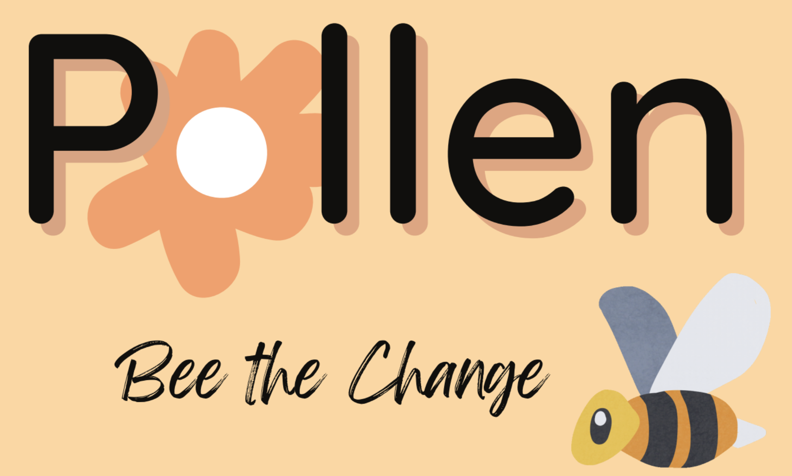

# pollen_app

*An app to empower and elevate student-led clubs, built using a [React Native](https://reactnative.dev/) frontend and a [Python 3.8](https://www.python.org) (via [Django](https://www.djangoproject.com/)) backend.*

---

Currently a work-in-progress, but hope to have a fully-functioning version soon!

If you have any questions or want to know more about the project, please don't hesitate to contact me at <davidlechan@gmail.com>.
